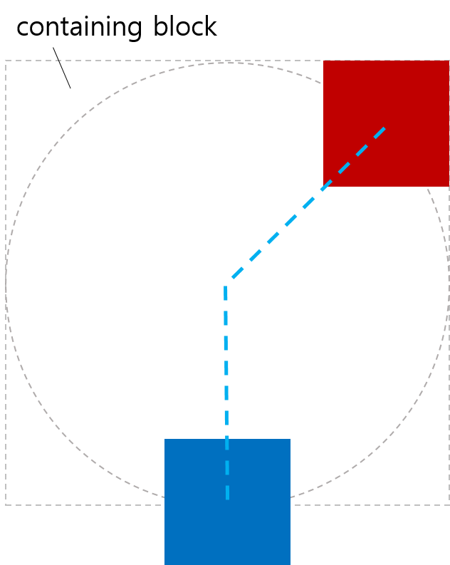
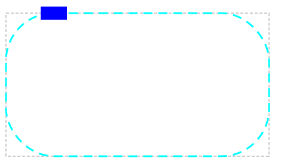
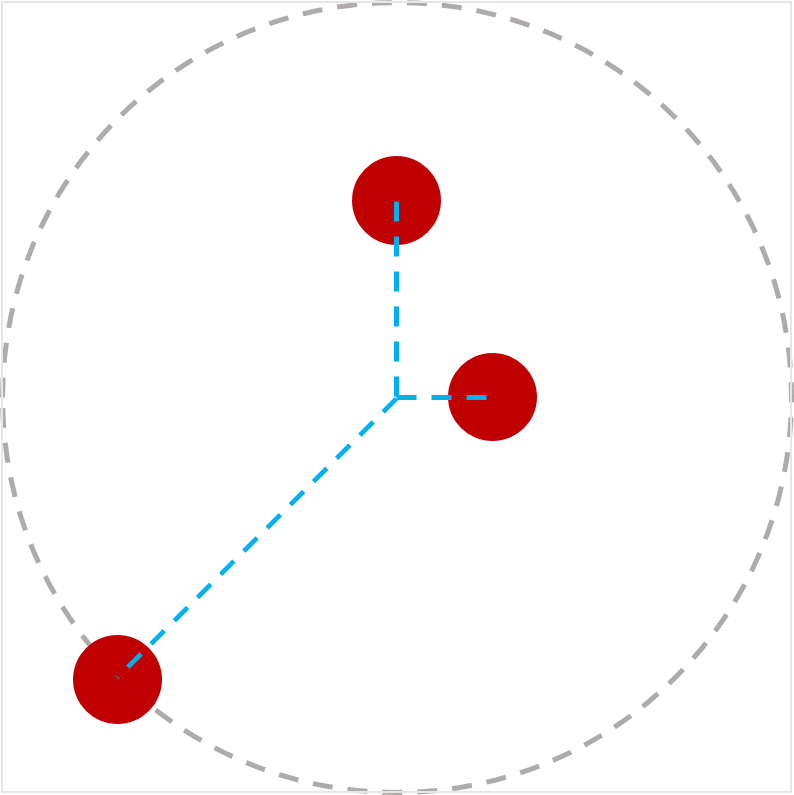
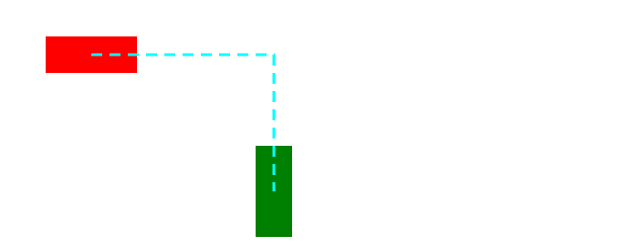
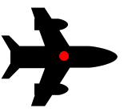
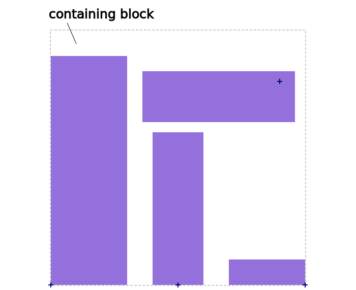
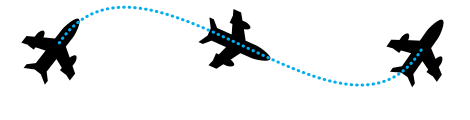
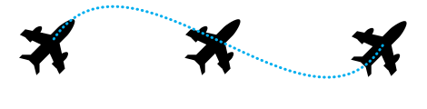

在 CSS 动画中，我们平常都会通过 CSS Animation 和 CSS Transform 等实现一些简单的 CSS 动画。然而，要想让动画对象沿着一条路径进行移动，还是有一些难点的。CSS Motion Path 标准的出现，让开发者能够给动画对象定义一条动画路径，配合 keyframe 等操作，轻松实现让一个物体沿着一条路径进行动画。

Motion Path Level 1 从 2015 年 4 月 9 日发表第一个工作草案以来，经过3年多的时间，发展得已经比较成熟了，同时 Google Chrome、Opera 浏览器也是第一批能够支持大部分草案标准功能的浏览器。

下面我们就来了解一下吧。

## 动作路径

既然是要让对象沿着一条路径走，那么本标准中最重要的点就在如何定义路径上了。

### offset-path

`offset-path` 即为定义路径的属性，它能够接受 `ray()`、CSS Shaps 中的图形 以及能够接受类似 SVG 路径定义的 `path()`。

> 在 Chrome 中，目前叫 motion-path

#### ray()

`ray()`即为辐射线。它以容器的中心为圆心，在容器中嵌入一个能够嵌入的最大圆形，结合自定义的夹角，将圆心与边上的点相连，形成路径。

`ray`接受三个参数，分别是角度，大小以及设置是否让对象完全包含在路径内。

用下面的例子进行一一解释

```html
<style>
    body {
        transform-style: preserve-3d;
        width: 200px;
        height: 200px;
    }
    .box {
        width: 50px;
        height: 50px;
        offset-position: 50% 50%;
        offset-distance: 100%;
        offset-rotate: 0deg;
    }
    #redBox {
        background-color: red;
        offset-path: ray(45deg closest-side);
    }
    #blueBox {
        background-color: blue;
        offset-path: ray(180deg closest-side);
    }
</style>
<body>
    <div class="box" id="redBox"></div>
    <div class="box" id="blueBox"></div>
</body>
```



##### 角度

即 CSS 中的角度定义，如上图，45deg 和 90deg 分别形成 45 度和 90 度的夹角。

##### 大小

第二个大小参数决定了路径的长短，它支持以下的属性

| 属性值          | 含义                     |
| --------------- | ------------------------ |
| closest-side    | 初始位置到最近一边的距离 |
| closest-corner  | 初始位置到最近一角的距离 |
| farthest-side   | 初始位置到最远一遍的距离 |
| farthest-corner | 初始位置到最远一角的距离 |
| sides           | 初始位置到交线的距离     |

##### contain

设置对象是否完全包含在路径之中

如果上述例子设置了 conatin，两个 box 将会完全包含在路径之内

`offset-path: ray(90deg, closest-side, contain)`


#### CSS  图形

我们还能利用 CSS 中的形状来定义动作路径，CSS 中的形状我们已经不陌生了，例如`inset() ` , `circle()`,  `ellipse()`, `polygon()`，甚至还能使用盒模型的数值如 `margin-box`, `border-box`, `padding-box`, `content-box`。

下面这个例子使用了 `margin-box` 的边作为动作路径：

```html
<style>
    body {
        width: 500px;
        height: 300px;
        border-radius: 80px;
        border: dashed aqua;
        margin: 0;
    }
    #blueBox {
        width: 40px;
        height: 20px;
        background-color: blue;
        offset-path: margin-box;
    }
</style>
<body>
    <div id="blueBox"></div>
</body>
```



#### path()

`path()` 可以接受 SVG 中的几何描述数据作为动作路径

```css
.path {
    offset-path: path('M150 0 L75 200 L225 200 Z');
}
```

如上代码使用 SVG 描述一个三角形，那么这个对象的动作路径即为这个三角形，那么他的初始位置以及初始方向，可以参考 SVG 相关标准进行设定。

#### url

url 与 上面的 `path()` 相同，`path()` 直接将 SVG 几何描述内容写到 CSS 中，url 则可以直接引用 SVG 文件。

### offset-distance

`offset-distance` 用于设定对象在路径上的位置。

```html
<style>
    body {
        transform-style: preserve-3d;
        width: 300px;
        height: 300px;
        border: dashed gray;
        border-radius: 50%;
    }
    .circleBox {
        position: absolute;
        left: 50%;
        top: 50%;
        width: 40px;
        height: 40px;
        background-color: red;
        border-radius: 50%;
    }
    #circle1 {
        offset-path: ray(0deg farthest-side);
        offset-distance: 50%;
    }
    #circle2 {
        offset-path: ray(90deg farthest-side);
        offset-distance: 20%;
    }
    #circle3 {
        offset-path: ray(225deg farthest-side);
        offset-distance: 100%;
    }
</style>
<body>
    <div class="circleBox" id="circle1"></div>
    <div class="circleBox" id="circle2"></div>
    <div class="circleBox" id="circle3"></div>
</body>

```



 上面例子中，通过设定三个不同的`offset-distance`设定对应对象在路径上的位置分别为 50%, 20%, 100%。

那么对于 SVG 的几何图形，我们所设定的一些路径可能没有闭合，那么 `offset-distance` 设定超过 100% 会怎么样呢？

```html
<style>
    .item {
        width: 100px;
        height: 40px;
        offset-position: 0% 0%;
        offset-path: path('m 0 0 h 200 v 150');
    }
    #box1 {
        background-color: red;
        offset-distance: -280%;
    }
    #box2 {
        background-color: green;
        offset-distance: 190%;
    }
</style>
<body>
    <div class="item" id="box1"></div>
    <div class="item" id="box2"></div>
</body>
```



可以看到，两个分别设置在 -280% 和 +190% 的位置，最终由于路径没有形成闭合，两个对象停留在最小和最大的可达位置。

```html
<style>
    .item {
        width: 100px;
        height: 40px;
        offset-position: 0% 0%;
        offset-path: path('m 0 0 h 200 v 150 z');
    }
    #box1 {
        background-color: red;
        offset-distance: -280%;
    }
    #box2 {
        background-color: green;
        offset-distance: 190%;
    }
</style>
<body>
    <div class="item" id="box1"></div>
    <div class="item" id="box2"></div>
</body>
```


上面的例子则演示了闭合路径的状态，两个对象均可在路径上“循环”移动。

### offset-position

`offset-position` 指定了路径本身的初始位置在哪里，可以提供属性值`auto`或者指定的位置。如果`offset-position`为`auto`并且`position`不为`static`，那么默认的`offset-position`则为`position`的位置。

```html
<style>
    #wrap {
        position: relative;
        width: 300px;
        height: 300px;
        border: 1px solid black;
    }

    #box {
        width: 100px;
        height: 100px;
        background-color: green;
        position: absolute;
        top: 100px;
        left: 80px;
        offset-position: auto;
        offset-anchor: center;
        offset-path: ray(45deg);
    }
</style>
<body>
    <div id="wrap">
        <div id="box"></div>
    </div>
</body>
```


### offset-anchor

需要移动的对象可能不一定得是对象的正中心，我们想要自定义对象的锚点，则可以通过`offset-anchor`来实现。

```css
#plane {
    offset-anchor: center;
}
```



上面例子指定了对象的锚点在中心位置。

```html
<style>
    body {
        transform-style: preserve-3d;
        width: 300px;
        height: 300px;
        border: 2px solid gray;
        border-radius: 50%;
    }
    .box {
        width: 50px;
        height: 50px;
        background-color: orange;
        offset-position: 50% 50%;
        offset-distance: 100%;
        offset-rotate: 0deg;
    }
    #item1 {
        offset-path: ray(45deg closest-side);
        offset-anchor: right top;
    }
    #item2 {
        offset-path: ray(135deg closest-side);
        offset-anchor: right bottom;
    }
    #item3 {
        offset-path: ray(225deg closest-side);
        offset-anchor: left bottom;
    }
    #item4 {
        offset-path: ray(315deg closest-side);
        offset-anchor: left top;
    }
</style>
<body>
    <div class="box" id="item1"></div>
    <div class="box" id="item2"></div>
    <div class="box" id="item3"></div>
    <div class="box" id="item4"></div>
</body>
```


上面例子中指定了四个矩形的四个不同的锚点位置。

如果 `offset-anchor` 的属性值为 `auto`，有如下规则进行计算：

| 条件                                              | 结果                            |
| ------------------------------------------------- | ------------------------------- |
| offset-path: none;<br />offset-position: 非 auto; | 取 offset-position 的值         |
| offset-anchor: auto;<br />offset-path: none;      | 与 background-position 行为相同 |
| 如果上述都不符合                                  | 取 transform-origin 的值        |

```html
<style>
    body {
        width: 500px;
        height: 500px;
    }
    .box {
        background-color: mediumpurple;
        offset-path: none;
        offset-anchor: auto;
    }
    #item1 {
        offset-position: 90% 20%;
        width: 60%;
        height: 20%;
    }
    #item2 {
        offset-position: 100% 100%;
        width: 30%;
        height: 10%;
    }
    #item3 {
        offset-position: 50% 100%;
        width: 20%;
        height: 60%;
    }
    #item4 {
        offset-position: 0% 100%;
        width: 30%;
        height: 90%;
    }
</style>
<body>
    <div class="box" id="item1"></div>
    <div class="box" id="item2"></div>
    <div class="box" id="item3"></div>
    <div class="box" id="item4"></div>
</body>
```



上面例子展示了，`offset-anchor` 为 `auto` 时，锚点的位置计算结果。

### offset-rotate

`offset-rotate` 指定了对象的旋转角度或是如何自动旋转。

| 属性值     | 效果                                                         |
| ---------- | ------------------------------------------------------------ |
| auto       | 对象根据当前路径的朝向进行旋转<br />如果对 offset-distance 进行动画，对象也会随着当前点的朝向进行旋转 |
| reverse    | 与 auto 效果相同，但与朝向相反                               |
| 自定义角度 | 对象始终朝着一个方向旋转                                     |

当属性值为 `auto` 时，随着 `offset-distance` 的改变，角度也会自动改变



当属性值为 `reverse `时，角度与朝向相反


当属性值为 `-45deg` 时，角度始终不变



## 在线演示

- <http://codepen.io/danwilson/pen/ZGmeRO>
- <http://codepen.io/yisi/pen/zGzJYd>
- <http://codepen.io/ericwilligers/pen/zGRdxQ>
- <http://codepen.io/ericwilligers/pen/pJarJO>
- <http://jsfiddle.net/ericwilligers/v79bdL3p/>

## 参考资料

- https://www.w3.org/TR/2018/WD-motion-1-20181218/
- https://codepen.io/danwilson/post/css-motion-paths-2016
- https://www.chromestatus.com/feature/6190642178818048